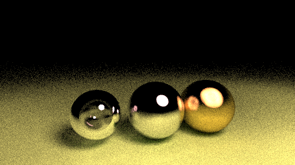

# alvinw-raytracer
A ray tracer implemented in Rust with help from [Ray Tracing in One Weekend](https://raytracing.github.io/).

Also has triangles and some simple lighting. Shadows are only really visible when everything is dark though.

Runs on the CPU and renders PNG images.

<small>A 500x281 (16:9) render with 100 samples per pixel. Took just over 11 minutes to render.</small>

<small>A 500x281 (16:9) render with 1000 samples per pixel. Took 32 seconds to render. When it's dark shadows are easier to see.</small>